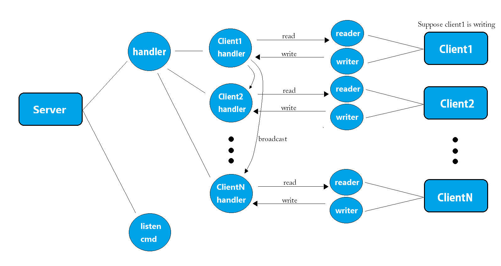
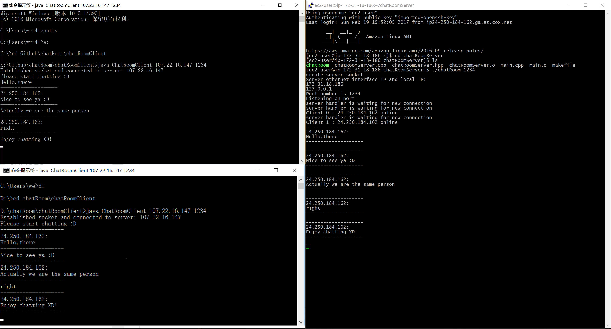
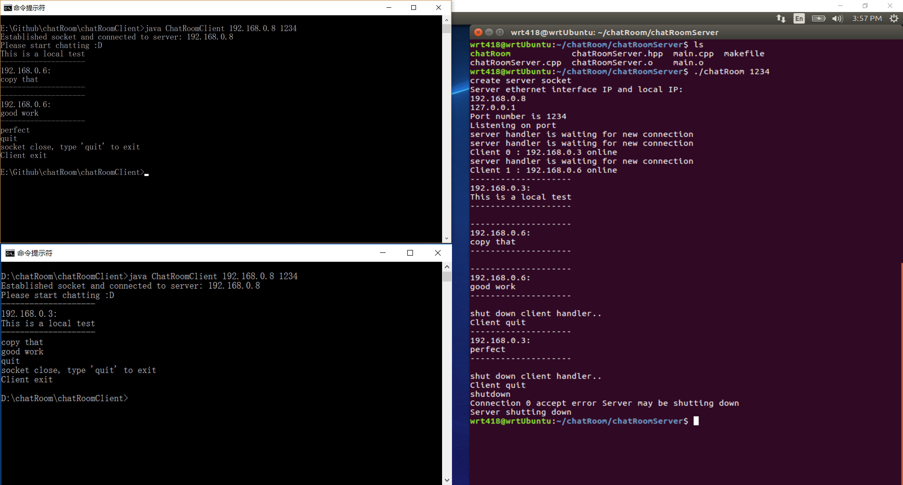

# ChatRoom
## Description
This is a personal project by [Interfish](https://github.com/Interfish). I developed a chatroom app where anyone who get connected 
can send text message(limited for ASCII) to everyone in the room. This app use TCP/IP and Socket.

Server side is written in C++. It use linix network library so it can only be run on Unix-like platform. Once running, the server will first try to create a socket and bind and listen to port specified by start-up argument. Then server will create a handler thread to catch incoming connnection request, while the main thread keep on listening command from the server side. Once a connection established, handler will create a client-handler thread. The client-handler thread will listen on incomming data, and boradcast it to every other client-handlers. The maximum number of clients is set to 5 by default.

Client side is written in Java. Once running, the client will create two threads. Read thread will listen on incomming data and print them
on the screen. Write thread will listen on standard input stream for user input and send them through socket. 

Prototype folder is only doing for learning purpose. There are a python server and a Java client. It does not affect the app.

## Usage
Note: If the server and clients are in the same network, server will print it's IP address after start. If they are in different network,
you need to obtain server's external/public IP through some way. 

Port number of server and clients must be the same.
### Server
Complie on *nix:

    make

Run:

    ./chatRoomServer portnumber
    
While running, you can type "shutdown" to shutdown the server.

      shutdown
      
### Client
Compile:

    make
    
Run:

    java ChatRoomClient IP_of_server portnumber
    
While running, you can type "quit" to quit the client program.

    quit

## Examples
This is a screenshot when server is deployed on an Amazon AWS EC2 and clients are running in my living room.

This is a screenshot when server and client are running within my home's local network through a router.

